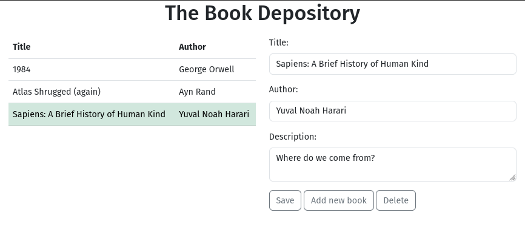
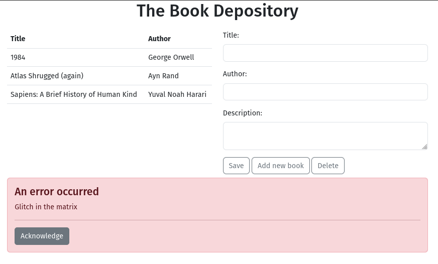

# The Book Depository

This is a demo application for maintaining a list of books.
It allows users to add, edit and delete books.

## Technologies 
The backend is implemented using the Django framework (Python).  
Postgresql serves as the database while the frontend is built with React.  
Reactstrap is used for styling the app.

All three services are run inside their respective Docker containers.

## Requirements
To run this app, [Docker](https://docs.docker.com/engine/install/) needs to be installed on your system.

## The application

### How to start/stop the app
To **start** the app, `cd` into the the_book_depository_proj -directory  
and run `docker compose up -d --build`.

Once the containers are up and running, open your browser and navigate to  
`localhost:3000`.

To **stop** the app, run `docker compose down` in the same directory.

**IF** the UI cannot connect to the backend, it's probably because the backend container  
did not start successfully. This can occur if e.g. the db container was not ready yet.

In such an instance, stop all the containers and then start them again. 

### User interface and functionality

A list of saved books is displayed on the page. Selecting a book populates  
the form, where you can then edit the book. Clicking on 'Save' persists  
the book in the database.

'Delete' deletes the selected book from the database.

'Add new book' clears the form and moves the cursor to the 'Title' input.
Fill all fields and click 'Save' to save the new book.

### Tests
There are a couple of [tests](./the_book_depository_proj/books/tests) for the backend. Since the app is dockerized,  
the tests need to be run inside the container.  

To do this, make sure the app is [running](#how-to-start/stop-the-app)  
and then run `docker exec -it the_book_depository_proj-web-1 bash`  
to enter the container for the backend. Once you're in, run  
`python manage.py test books/tests -v 2` to run all tests in the books/tests  -directory.

As of now, there are no tests for the frontend. The UI however displays errormessages,  
should 'Save', 'Add new book' or 'Delete' produce an error:
  
You can do away with the error message by clicking 'Acknowledge'.

## Potential TODOs

* Add nginx or another web server to serve static files.  
This demo app uses the dev server provided by React.

* Convert to Typescript for type safety and improved developer experience
  (Intellisense).

* Figure out a better way for running the backend tests

* Add tests for core frontend funtionality, perhaps even an end-to-end test (look into Cypress or Playwright)

* Make starting app from scratch more robust 
(starting is sometimes a bit flaky, the web app may try to connect to db before it is ready)

* Different db's for dev, prod
